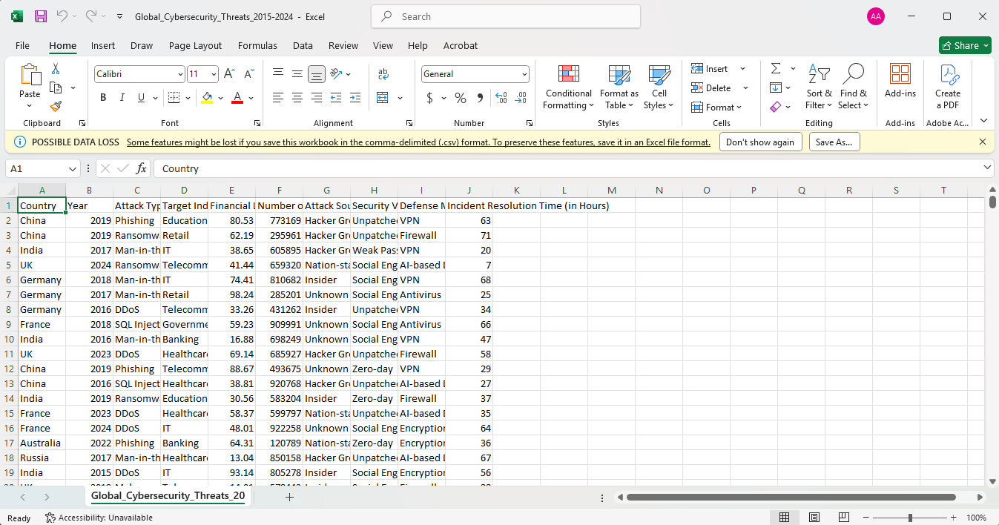
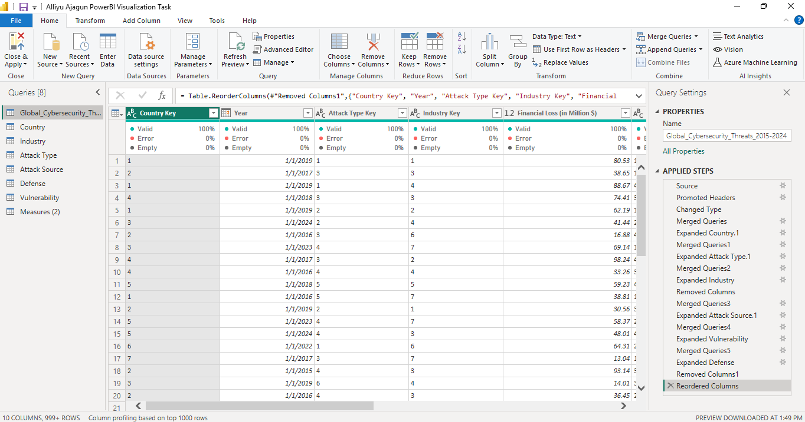
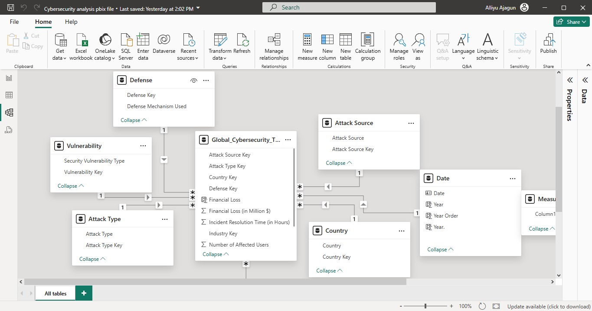
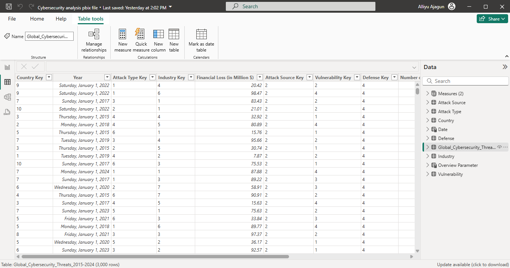
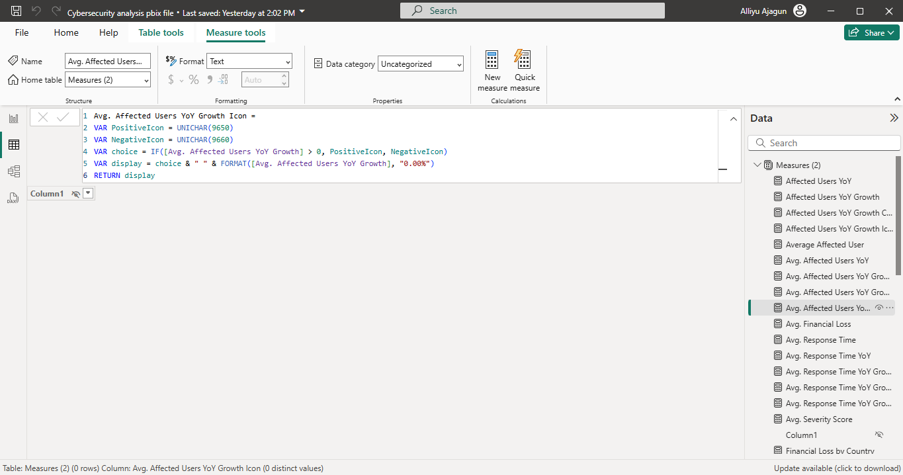
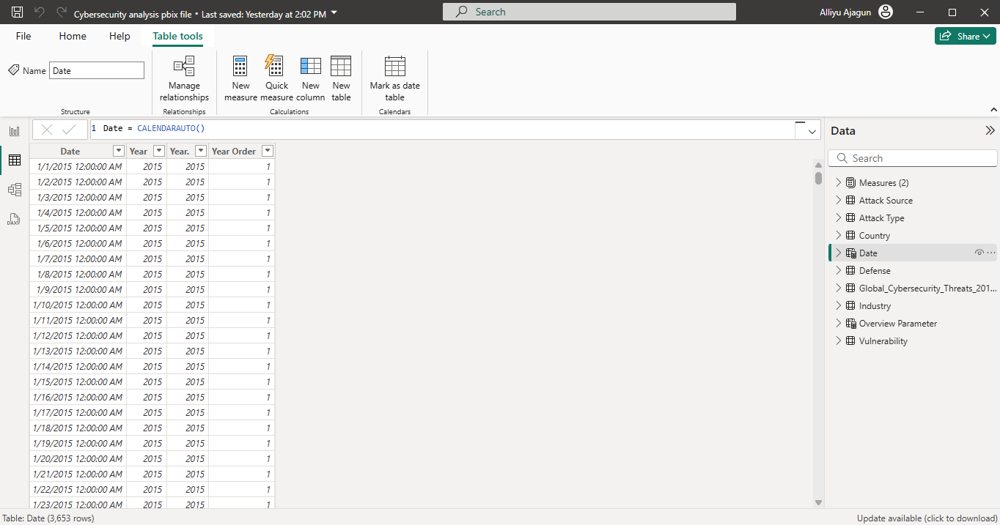
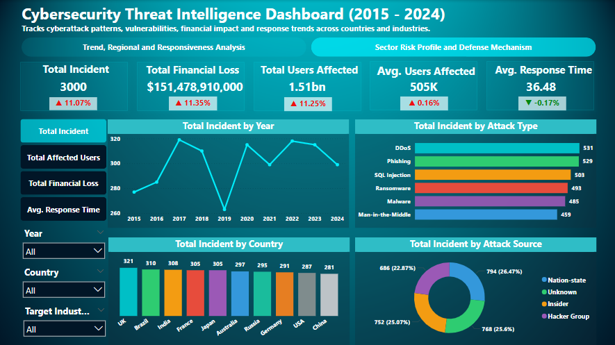
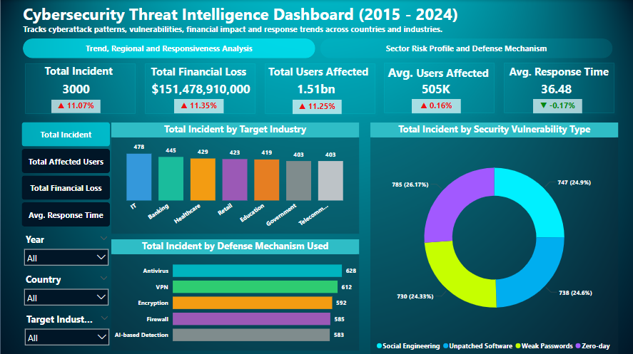

# Cybersecurity-Intelligence
A Visual deep dive into global cybersecurity trends, threats and response strategies using Power BI

# Table of Contents
- [ Introduction: Project Overview](#-introduction-project-overview)
- [ Project Goal](#-project-goal)
- [ Methodology](#-methodology)
- [ Data Visualization](#-data-visualization)
- [ Dataset](#️-dataset)
- [ Dashboard](#️-dashboard)
- [ Key Statistics](#-key-statistics)
- [ Trends and Insights](#-trends-and-insights)
- [ Recommendations for Mitigation](#-recommendations-for-mitigation)
- [ Conclusion](#-conclusion)

# Introduction: Project Overview
## Title: Global Cybersecurity Threats Analysis (2015–2024)
This project presents a comprehensive analysis of global cybersecurity threats between 2015 and 2024. Using data sourced from Kaggle, we leveraged Power BI to uncover trends, evaluate risk impact, and visualize key threat patterns across countries, attack types, and response strategies. The goal is to transform raw cybersecurity data into actionable insights for decision-makers and IT security professionals.
Threat volume, financial impact and users exposure are all rising while response time is improving slightly but not significantly. This implies that threat sevrity is outpacing defensive improvement.

# Project Goal
The primary objective of this project is to:
- Identify trends in global cybersecurity incidents from 2015 to 2024.
- Highlight the financial and human impact of these threats.
- Reveal the most common types and sources of cyberattacks.
- Evaluate response times by country.
- Provide data-driven recommendations to mitigate future cyber risks.

# Methodology
This project followed a structured data-driven approach to analyze global cybersecurity threats from 2015–2024. The methodology consisted of four key phases:
1. Data Collection & Sourcing
2. Data Cleaning & Preprocessing
3. Data Analysis 
4. Reporting & Visualization

-Tool Used: Power BI
-Dataset Source: Kaggle
-Data Cleaning: Power Query Editor
-Analysis Focus: Incident frequency, Financial losses, User exposure, Attack vectors, Source attribution, Response efficiency
-Visuals Used: Line charts, Bar graphs, KPI cards, Maps, Slicers, Tables.

# Data Visualization
## Dataset
Below are sample views of the dataset used for this project and the analysis process:

## Dashboard 
### These images show parts of the developed dashboards: 

To interact with the report: [**CLICK HERE**](https://app.powerbi.com/view?r=eyJrIjoiNzMwZTNjZDItMjFhYy00OTM2LWI4MWEtNGZlMmI5MzAyODE0IiwidCI6ImI2NDU3ZDY4LTQzODgtNGMzYS04MjIyLTc0ZGU0NDU5ZDFlZiJ9)

# Key Statistics
- **Total Incidents:** 3,000
- **Financial Losses:** $151.48 billion
- **Users Affected:** 1.51 billion 
- **Average Users per Incident:** 505,000
- **Average Response Time:** 36.48 hours

# Trends and Insights
## Hack Volume
- Sharp rise in 2020 and 2022, peaking at about 320 incidents/year
- Slight drop in 2024, possibly due to improved detection and response systems.
## User Exposure & Financial Cost
- Peak impact years: 2017 and 2023. 2017 being the most damaging year ($16 billion loss)
- A significant decline from 2017 to 2019.
- Losses increased in 2020 and post 2020, this is probably due to increased hybrid work.
## Industry-Specific Impact
- IT sector losses reached $25 billion
- Banking/finance also lost $23 billion.
- These sectors remain the prime target due to their high data sensitivity.
## Global Impact
- Germany, Brazil, UK, India, China, USA are top affected.  UK suffered the highest financial loss ($16.5 billion) and recorded the highest attack volume.
- Losses are evenly distributed across regions which indicates that there is no safe zone.
## Attack Types
- DDoS, Phishing, SQL Injection are the most common
- DDoS & Phishing caused $28 billion and $ 27 billion in losses respectively
- SQL Injection and Ransomware followed closely with $25 billion and $24 billion impact respectively.
## Attack Sources
- Unknown sources: $40.5 billion losses
- Hacker groups, nation-states, insiders: $35+ billion each.
## Response Time
- Fastest: USA ( around 35 hours)
- Slowest: Brazil and China (37–38 hours)
- Global response improving, but still slow for modern threats.

# Recommendations for Mitigation
## 1. Strengthen Internal Controls
- Implement User Behavior Analytics
- Enforce strict identity/access policies
- Increase frequency of digital audits
## 2. Targeted Threat Mitigation
- Deploy cloud-based DDoS protection
- Conduct phishing simulations and staff training
## 3. Automated & Real-Time Response
- Adopt SOAR solutions
- Use AI for anomaly detection
## 4. Attribution & Visibility
- Invest in digital forensics tools
- Use threat intelligence platforms
## 5. Global Collaboration
- Join international cybersecurity alliances
- Share anonymized threat data to strengthen global resilience

## Conclusion
Cybersecurity threats have grown significantly in volume and financial impact from 2015–2024. With over **$151 billion** in losses and **1.5 billion** users affected globally, cybersecurity is no longer an IT responsibility alone, it's a **core business imperative**.
This Power BI project underscores the urgent need for **proactive defense, automation, user education, and global cooperation**. As the threat landscape continues to evolve, staying ahead requires real-time insight, collaborative intelligence sharing, and robust mitigation strategies.

Prepared by:
Ajagun Alliyu Aremu
IOTBTECH Fellowship — Data Analysis Track, Class of 2025  

Date: 27th June 2025
